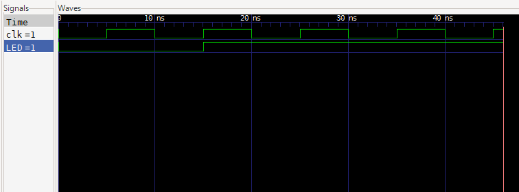

# On-Board LED Blinker

A simple Verilog FPGA project used to verify FPGA programming and onboard LED functionality on the Shrike Lite FPGA.

---

## Features
- Onboard LED blinking
- FPGA clock testing
- Basic GPIO output verification

---

## Hardware Used
- Shrike Lite FPGA

---

## Software Used
- Go Configure
- VS Code
- Verilog HDL

---

## Pinouts

| Signal | FPGA Pin |
|---|---|
| Onboard LED | Built-in |

---

## Output / Setup

https://github.com/user-attachments/assets/c4ca171e-5016-43cd-8d1a-54152894a19e

## Waveform/Simulation

---

## How It Works

The FPGA clock signal is passed through a clock divider to generate a slower signal visible to the human eye.  
The divided signal toggles the onboard LED continuously, creating a blinking effect.

---

## License

This project is licensed under the MIT License.
