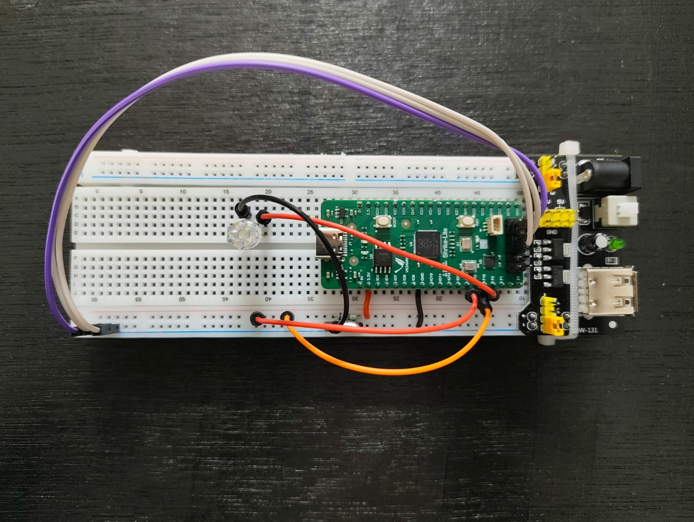

# Primitive Gates

A simple Verilog FPGA system that demonstrates the operation of primitive logic gates using selectable input combinations and control lines.

---

## Features

- GPIO pins configured in input/high-impedance mode
- Multiple logic gates implemented in a single design
- 3-bit select lines used to choose individual gates
- Real-time hardware output demonstration

---

## Hardware Used

- Shrike Lite FPGA
- Breadboard + Power Supply
- White LED
- Jumper wires

### Future Hardware Additions
- DIP switches for select lines
- DIP switches for input signals

---

## Software Used

- Go Configure
- VS Code
- Verilog HDL

---

## Pinouts

### Select Lines

| Signal | FPGA Pin |
|---|---|
| S0 | F8 |
| S1 | F10 |
| S2 | F12 |

### Input Signals

| Signal | FPGA Pin |
|---|---|
| A | F18 |
| B | F17 |

### Output

| Signal | FPGA Pin |
|---|---|
| Y | F0 |

---

## Images

### FPGA Setup

---

## Logic Gate Outputs

Add output images or videos here.

---

## How It Works

The FPGA reads the select-line inputs to determine which primitive logic gate should be active.  
Input signals `A` and `B` are processed through the selected gate, and the result is driven to the output LED.

The system demonstrates:
- AND
- OR
- XOR
- NAND
- NOR
- XNOR
- NOT

using a single FPGA design.

|Gate|Select Line Binary Code|
|  Y  | S2 | S1 | S0 |
|  AND  | 0 | 0 | 0 |
|  OR  | 0 | 0 | 1 |
|  XOR  | 0 | 1 | 0 |
|  NAND  | 1 | 1 | 1 |
|  NOR  | 1 | 0 | 0 |
|  XNOR  | 1 | 0 | 1 |
|  NOT A  | 1 | 1 | 0 |
|  NOT B  | 1 | 1 | 1 |

---

## Future Improvements

- Add DIP-switch control
- Add seven-segment display output
- Add truth-table visualization
- Expand to combinational logic circuits

---

## License

This project is licensed under the MIT License.
