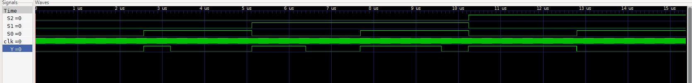

# PWM LED Controller (FPGA)

A simple Verilog-based PWM (Pulse Width Modulation) generator implemented on the Shrike Lite FPGA.  
The project uses 3-bit input switches to control LED brightness levels.

---

## Features

- 8-bit PWM generation using counter-based method
- 3-bit switch-controlled brightness selection
- Hardware-based LED dimming (no analog components required)
- Simple combinational + sequential design
- FPGA GPIO interfacing

---

## Hardware Used

- Shrike Lite FPGA
- External LED
- Breadboard (optional)
- Current limiting resistor (220Ω recommended)
- Jumper wires

---

## Software Used

- Go Configure Hub (bitstream generation + I/O mapping)
- VS Code (Verilog development)
- Verilog HDL

---

## Pinouts

| Signal | FPGA Pin | Direction |
|---|---|---|
| clk | CLK | Input |
| S0 | F8 | Input |
| S1 | F10 | Input |
| S2 | F12 | Input |
| Y  | F0 | Output |

## Setup

add setup image

---

## How It Works

### Brightness Selection

The 3-bit input `{S2, S1, S0}` selects a fixed PWM duty reference:

| Select | Brightness Value (8-bit) |
|---|---|
| 000 | 0 |
| 001 | 64 |
| 010 | 128 |
| 011 | 192 |
| 100 | 255 |

This value controls the duty cycle of the output LED.

---

### PWM Generation Logic

- An 8-bit counter increments on every rising edge of `clk`
- The LED output is generated by comparing:

- This creates a PWM waveform where:
  - Higher brightness → longer ON time
  - Lower brightness → shorter ON time
---

## Output 

add output video

## Waveform/Simulation

---

## License

This project is licensed under the MIT License.
