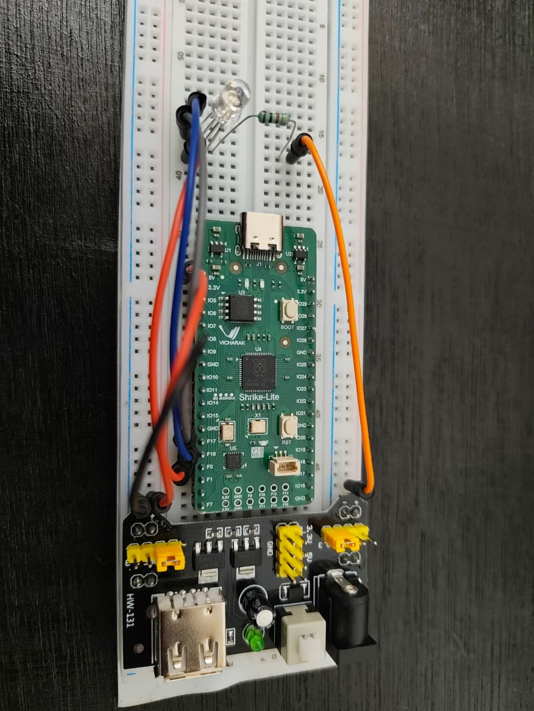

# RGB LED Controller

A simple Verilog FPGA project that cycles RGB LED colours using clock division on the Shrike Lite FPGA.

---

## Features

- RGB colour cycling
- Common-anode RGB LED support
- FPGA GPIO control
- Hardware clock division

---

## Hardware Used

- Shrike Lite FPGA
- External RGB LED
- Breadboard
- Jumper wires

---

## Software Used

- Go Configure
- VS Code
- Verilog HDL

---

## Pinouts

| Signal | FPGA Pin |
|---|---|
| Red Channel | F0 |
| Green Channel | F18 |
| Blue Channel | F17 |
| VCC | 3.3V |

---

## Images

### FPGA Setup

## Demo Video

https://github.com/user-attachments/assets/f4eda74b-b679-4501-9c47-efcac0708e68

---

## How It Works

The FPGA uses a clock divider to slow down the onboard clock signal.  
The divided clock drives a counter which changes the RGB LED output states, creating a colour-cycling effect.

Because the RGB LED is common-anode, the LED channels are active-low.

---

## License

This project is licensed under the MIT License.
